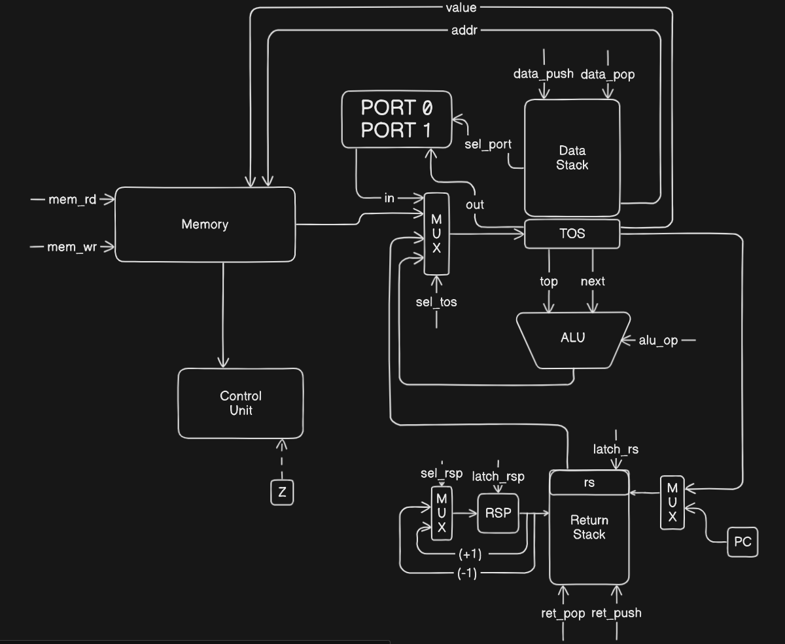
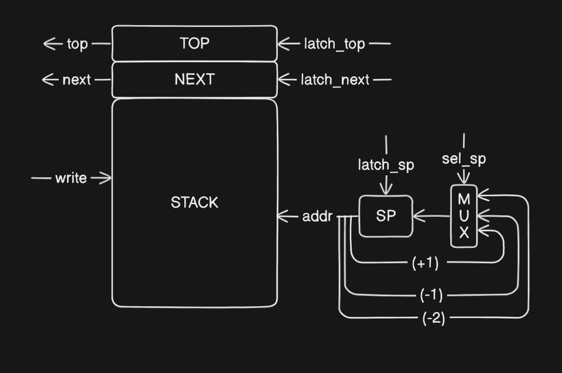
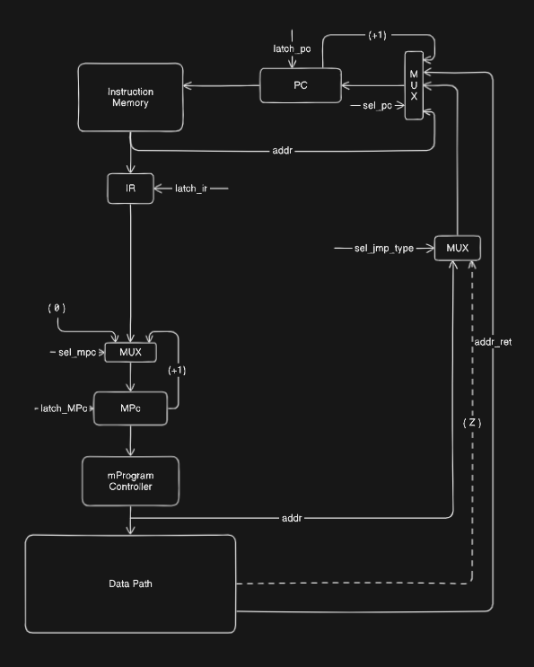

# Транслятор и Модель для языка Forth

- Кобелев Роман, P3212
- `forth | stack | harv | mc -> hw | tick -> instr | struct | stream | port | pstr | prob2`
- Базовый вариант

## Язык программирования

По варианту нужно реализовать FORTH-подобный язык

```ebnf
<program> ::= <definition>*
<definition> ::= <word-definition> | <variable-definition> |<variable-allocation-definition> | <word>
<word-definition> ::= ":" <identifier> <body> ";"
<body> ::= <word>*
<word> ::= <number> | <operand> | <word-name> | <conditional> | <loop> | <comment>
<number> ::= <digit>+
<operand> ::= "+" 
            | "-" 
            | "*" 
            | "/" 
            | "read"
            | "emit" 
            | "@" 
            | "!" 
            | "mod" 
            | "<" 
            | ">" 
            | "="
            | "swap"
            | "over"
            | "dup"
            | "drop"

<variable-definition> ::= "VARIABLE" <word-name>
<variable-allocation-definition> ::= "VARIABLE" <word-name> <number> "ALLOCATE"
<conditional> ::= "IF" <body> "THEN" | "IF" <body> "ELSE" <body> "THEN" 
<loop> ::= "do" <body> "loop" | "begin" <body> "until"
<identifier> ::= <letter> (<letter> | <digit>)*
<comment> ::= "\" <any symbol except "\n">
```

### Команды

`nop` - ничего не делает (нигде не используется)

`+` - (n1 n2 -- n3)

`-` - (n1 n2 -- n3)

`*` - (n1 n2 -- n3)

`/` - (n1 n2 -- n3)

`mod` - (n1 n2 -- n3)

`=` - (n1 n2 -- n3) n3 = -1 if n1 == n2 else 0

`<` - (n1 n2 -- n3) n3 = -1 if n1 < n2 else 0

`>` - (n1 n2 -- n3) n3 = -1 if n1 > n2 else 0

`swap` - (n1 n2 -- n2 n1)

`drop` - (n1 n2 -- n1)

`over` - (n1 n2 -- n1 n2 n1)

`read` - (n1 -- n2) - прочитать символ из порта `n1` и положить на стек

`emit` - (n1 n2 -- ) - вывести ASCII символ с кодом `n1` в порт `n2`

`!` - (n1 n2 -- ) - записывает в память по адресу `n1` занчение `n2`

`@` - (n1 -- n2) - загружает из памяти значение по адресу `n1`

Условный оператор `if` берёт значение из стек и выполняет код только, если на стеке `0`

Оператор цикла `do loop`, напоминающий конструкцию `for` в большинтсве языков на основе `C`. специальное слово `i` помещает текущий индекс цикла в стек. Два верхних значения в стеке дают начальное значение (включительно) и конечное значение (исключая) для значения `i`. Начальное значение берется с вершины стека.

Оператор цикла `begin until` выполняет цикл до того момента, пока в конце итерации в начале стека не окажется `0`

Оператор объявления переменной `variable` создаёт переменную и сопоставляет ей определённую ячейку памяти. Взаимодействовать с переменной можно, обюратившись к ней по имени переменной и операторов `!` и `@`. Также с помощью ключевого слова `allocate` можно выделить произвольное количество памяти, где обратившись по начальному адресу найдём длину выделенного участка.

Процедура должна задаваться отдельно, начиная с `:`, дальше идёт название процедуры, а конец процедуры обозначается `;`. Вызов процедуры происходит, написав название процедуры.

## Организация памяти

- Память раздельная
- Размер машинного слова - 32 бита.
- Размер машинного слова команд -- 40 бит, первые 8 бит -- тип команды (размер условен, кодирование в виде json)
- Машинная команда может быть с аргументом и без
- Для реализации подпрограмм присутствует стек возврата, как отдельное физическое устройство, в котором хранятся адреса возврата
- Управление процессором осуществляется с помощью микрокода

```text
       Instruction memory
+-----------------------------+
| 00       program            |
| 01       program            |
|      ...                    |
| 15000    program            |
+-----------------------------+

             Memory
+-----------------------------+
| 00       variables          |
| 01       variables          |
|      ...                    |
| 10       size of allocation |
| 11       1 object of alloc  |
|      ...                    |
+-----------------------------+

           Data stack
+-----------------------------+
| 00       value              |
| 01       value              |
|      ...                    |
| 10       NEXT               |      +--+
| 11       TOP                |  <-- |SP|
|      ...                    |      +--+
+-----------------------------+

       Microprogram memory
+------------------------------+
| 00       Signals             |
| 01       Signals             |
|      ...                     |
+------------------------------+
```

В памяти данных хранятся 2 вида переменных:

- Единичные переменные
- Переменные, созданные с помощью ключевого слова `ALLOCATE`. Выделяется `n+1` ячейка, где в первой хранится размер, а в последующих сами данные

### Сигналы в микрокомандах

- `MUX` - управляющиё сигнал на мультиплексоре
  - `TOP` - входящее значение на стек
  - `SP` - выбор значения `SP`
  - `RSP` - выбор значения `RSP`
  - `RS` - выбор значения `RS`
  - `PC` - выбор значения `PC`
  - `JMP_TYPE` - тип выбора `PC`
  - `MPC` - выбор значения `MPC`
- `ALU` - сигнал выбора операции на АЛУ
- `Latch` - защёлкнуть регистр
  - `TOP` - Top of Stack
  - `NEXT` - Next to Top
  - `PC` - Program Counter
  - `MPC` - Micro Program Counter
  - `RS` - Top of Return Stack
  - `IR` - Instruction Register
  - `SP` - Stack Pointer
  - `RSP` - Return Stack Pointer
- `MEMORY` - сигнал на управление памятью данных
  - `WR` - записать значение переменной в память
  - `RD` - получить значение переменной из памяти
- `IO` - сигналы работы с портами
  - `IN` - получить значение из нужного порта
  - `OUT` - отдать значение по нужному порту

Все сигналы хранится в модуле [mc.py](mc.py#L7)

## Система команд

- Адресация - абсолютная.
- Доступ к памяти данных осуществляется по адресу, который хранится в регистре `NEXT`, к памяти инструкций по адресу, который лежит в регистре `PC`
- Ввод/Вывод происходит с данными, которые лежат в `TOP` и `NEXT`
  - Порты реализованы с помощью буфера чисел
- Поток управления
  - Автоинкремент `PC`
  - Безусловный переход - `JMP` `ZJMP` `CALL` `RET`
  - Условный переход - `JMP`, если в `TOP` не ноль
  - `HALT` - остановка программы
  
### Цикл исполнения команд
  
1. Выборка инструкции (Инкрементирование `PC`, загрузка команды в `IR`)
2. Исполнение команды (Ниже в таблицы представлено все выполняемы команды)

### Набор инструкций

В таблице ниже
приведены все элементы системы команд ([isa.py:Opcode](isa.py#L32)). Большинство инструкций соответствуют слову из языка программирования (см. описание в разделе `Язык программирования`)

| Инструкция     | Кол-во тактов | Описание                                                                                            |
|----------------|:-------------:|-----------------------------------------------------------------------------------------------------|
| `ADD`          |       1       | NEXT = TOP + NEXT, SP--                                                                             |
| `MUL`          |       1       | NEXT = TOP * NEXT, SP--                                                                             |
| `DIV`          |       1       | NEXT = NEXT / TOP, SP--                                                                             |
| `SUB`          |       1       | NEXT = NEXT - TOP, SP--                                                                             |
| `MOD`          |       1       | NEXT = NEXT % TOP, SP--                                                                             |
| `HALT`         |       1       | Остановка программы                                                                                 |
| `JUMP` [addr]  |       1       | PC = IM[PC]                                                                                         |
| `ZJUMP` [addr] |       1       | IF Z PC = IM[PC]                                                                                    |
| `CALL` [addr]  |       2       | RSP++, RS[RSP] = PC, PC = IM[PC]                                                                    |
| `RET`          |       1       | PC = RS[RSP], RSP--                                                                                 |
| `NOP`          |       1       | Пустышка                                                                                            |
| `DROP`         |       1       | SP--                                                                                                |
| `GR`           |       1       | if NEXT > TOP NEXT = -1 else NEXT = 0, SP--                                                         |
| `LS`           |       1       | if NEXT < TOP NEXT = -1 else NEXT = 0, SP--                                                         |
| `EQ`           |       1       | if NEXT == TOP NEXT = -1 else NEXT = 0, SP--                                                        |
| `DUP`          |       2       | RSP++, RS[RSP] = TOP, SP++, TOP = RS[RSP], RSP--                                                    |
| `OVER`         |       3       | SP--, RSP++, RS[RSP] = TOP, SP = SP+2, TOP = RS[RSP], RSP--                                         |
| `SWAP`         |       4       | RSP++, RS[RSP] = TOP, SP--, RSP++, RS[RSP] = TOP, SP++, TOP = RS[RSP], RSP--, NEXT = RS[RSP], RSP-- |
| `POP`          |       1       | RSP++, RS[RSP] = TOP, SP--                                                                          |
| `RPOP`         |       1       | SP++, TOP = RS[RSP], RSP--                                                                          |
| `PUSH` [value] |       2       | RSP++, TOP = IM[PC]                                                                                 |
| `POP`          |       1       | RSP++, RS[RSP] = TOP, SP--                                                                          |
| `READ`         |       1       | TOP = INPUT                                                                                         |
| `EMIT`         |       2       | RSP++, RS[RSP] = TOP, SP--, OUTPUT = TOP, SP--, RSP--                                               |
| `LOAD`         |       1       | TOP = MEM[TOP]                                                                                      |
| `STORE`        |       1       | MEM[NEXT] = TOP, SP = SP - 2                                                                        |

Память микрокоманд хранится в модуле [mc.py](mc.py#L72)

### Кодирование инструкций

Инструкции и память кодируются в формат JSON и имеют вид:

```json
{
   "memory": {
      "0": 16,
   },
   "code": [
       {
           "index": 0,
           "command": "push",
           "arg": 8
       }
   ]
}
```

В блоке `memory` храниться, которая будет инициализироваться в начале выполнения. В блоке `code` аргумент может быть упущен

## Транслятор

Интерфейс командной строки `translator.py <input_file> <output_file>`

Основные существенные элементы, используемые в процессе трансляции:

- слово - исходное слово в тексте программы (разделён пробелами)
- терм ([isa.py:Term](isa.py#L65)) -- слово программы, преобразованное в формат машинной команды
- машинное слово ([isa.py:Instruction](isa.py#L90)) -- сама машинная команда

Трансляция происходит в несколько этапов (translator.py ([translator.py:translate](translator.py#L304))):

1. Разбиение исходного в текста программы в набор термов
2. Валидация полученных термов (переменные, циклы, процедуры, условные операторы)
3. Трансляция термов в машинний код
4. Линковка

### Разбиение исходного в текста программы в набор термов

Так как исходный код подаётся нам, как список слов (разделённые пробелами и переносами строки), процесс трансляции слов в токены не нуждается в объяснении ([translator.py:split_to_terms](translator.py#L121))

### Валидация полученных термов

Пользовательская программа должа удовлетворять формальным условиям (см. описание в разделе `Язык программирования`)

- терму `:` должен соответствовать терм `;`
- терму `do` должен соответствовать терм `loop`
- терму `begin` должен соответствовать терм `until`
- терму `if` должен соответствовать терм `then`, между ними может быть `else`
- объявление переменной должно иметь вид `variable <name> [allocate <int>]`

Таким образом проводиться проверка, пользователь при ошибке будет оповещён с термом и номером слова в тексте

Реализована ([translator.py:code_correctness_check](translator.py#L198))

### Трансляция термов в машинный код

В нашем случае каждому терму могут быть сопоставлены несколько инструкций, поэтому важно правильно заменить все термы на инструкции. Происходит следующая трансформация:

```python
list[Term] -> list[list[Instruction]] -> list[Instruction]
```

Хотел бы заострить внимание на трансляции таких термов, как `loop` и `i`. Они выглядят больше других из-за работы со стеком возврата, где мы храним параметры инициализации цикла.

Правила трансляции определены в функции [translator.py:term_to_instruction](translator.py#L226)

### Линковка

Такие термы, как `if`, `loop`, `until`, `:` нуждаются в дополняющем терме, к которому будут обращаться. Такая операция также происходит с `variable`.

Для преобразования данной структуры в последовательный список необходимо провести линковку. Для этого используется абослютная адресация, которая указывапет на номер конкретного терма.

Реализуется функцией [translator.py:fix_addresses](translator.py#L207)

## Модель процессора

Интерфейс командной строки: `machine.py <machine_code_file> <input_file>`

### Datapath



DataPath реализован в классе [datapath.py:DataPath](datapath.py#L9).

Особенности архитектуры:

- `Memory` - двунаправленная память данных
- `PORT` - Устройство, которое хранит в себе В/У ввода/выовода
- `Return Stack` - стек возврата
- `Data Stack` - стек данных. Схема с более детальным описанием модуля `TOS`:



### Controll Unit



Выполнение микроинструкции происходит в методе [control_unit.py:dispatch_micro_instruction](control_unit.py#L92)

Control Unit реализован в классе [control_unit.py:ControlUnit](control_unit.py#L8)

Особенности работы модели:

- Цикл осуществляется в функции [machine.py:simulation](machine.py#L12). там выполняется декодирование и выполнение инструкций
- Шаг моделирование соответствует одному тику с выводом состояния в журнал
- Для журнала используется стандартный модуль `logging`
- Количество тиков для моделирования лимитировано
- Остановка моделирования возможна при:
  - превышении лимита тиков
  - исключении `StopIteration` - если выполнена инструкция `HALT`

## Тестирование

- Тестирование осуществляется при помощи golden test-ов
- Настройка golden тестирования находится в [golden_test.py](golden_test.py)
- Конфигурация golden test-ов лежит в директории [golden](golden)

Запустить тесты -  `poetry run pytest . -v`

Обновить конфигурацию golden test-ов - `poetry run pytest . -v --update-goldens`

CI при помощи Github Actions:

```yaml
name: Check Python

on:
  push:
    branches:
      - main

jobs:
  test:
    runs-on: ubuntu-latest

    steps:
      - name: Checkout code
        uses: actions/checkout@v4

      - name: Set up Python
        uses: actions/setup-python@v4
        with:
          python-version: 3.12

      - name: Install dependencies
        run: |
          python3 -m pip install --upgrade pip
          pip3 install poetry
          poetry install

      - name: Run tests and collect coverage
        run: |
          poetry run coverage run -m pytest .
          poetry run coverage report -m
        env:
          CI: true

  lint:
    runs-on: ubuntu-latest

    steps:
      - name: Checkout code
        uses: actions/checkout@v4

      - name: Set up Python
        uses: actions/setup-python@v4
        with:
          python-version: 3.12

      - name: Install dependencies
        run: |
          python3 -m pip install --upgrade pip
          pip3 install poetry
          poetry install

      - name: Check code formatting with Ruff
        run: poetry run ruff format --check .

      - name: Run Ruff linters
        run: poetry run ruff check .
```

где:

- `poetry` - управление зависимостями для языка Pyuthon
- `coverage` - формирование отчёта об уровне покрытия исходного кода
- `pytest` - утилита для запуска тестов
- `ruff` - утилита для форматирования и проверки стиля кодирования

Пример использования и журнал работы процессора на примере `loop`:

```text
py translator.py forth/loop.fth machine/loop.json  
source LoC: 1 code instr: 25
py machine.py machine/loop.json 
DEBUG:root:[-1: NO_OPCODE] TICK: 0 MPC: 0 IR: None TOP: 0 NEXT: 0 RS: 0 SP: -1 RSP: -1
DEBUG:root:[0: NO_OPCODE] TICK: 1 MPC: 1 IR: None TOP: 0 NEXT: 0 RS: 0 SP: -1 RSP: -1
DEBUG:root:[0: push] TICK: 2 MPC: 2 IR: push const 8 TOP: 0 NEXT: 0 RS: 0 SP: -1 RSP: -1
DEBUG:root:[0: push] TICK: 3 MPC: 22 IR: push const 8 TOP: 0 NEXT: 0 RS: 0 SP: -1 RSP: -1
DEBUG:root:[0: push] TICK: 4 MPC: 23 IR: push const 8 TOP: 0 NEXT: 0 RS: 0 SP: 0 RSP: -1
DEBUG:root:[0: push] TICK: 5 MPC: 0 IR: push const 8 TOP: 8 NEXT: 0 RS: 0 SP: 0 RSP: -1
DEBUG:root:[1: push] TICK: 6 MPC: 1 IR: push const 8 TOP: 8 NEXT: 0 RS: 0 SP: 0 RSP: -1
DEBUG:root:[1: push] TICK: 7 MPC: 2 IR: push const 1 TOP: 8 NEXT: 0 RS: 0 SP: 0 RSP: -1
DEBUG:root:[1: push] TICK: 8 MPC: 22 IR: push const 1 TOP: 8 NEXT: 0 RS: 0 SP: 0 RSP: -1
...
...
...
DEBUG:root:[23: drop] TICK: 676 MPC: 0 IR: drop None TOP: 0 NEXT: 0 RS: 0 SP: -1 RSP: -1
DEBUG:root:[24: drop] TICK: 677 MPC: 1 IR: drop None TOP: 0 NEXT: 0 RS: 0 SP: -1 RSP: -1
DEBUG:root:[24: halt] TICK: 678 MPC: 2 IR: halt None TOP: 0 NEXT: 0 RS: 0 SP: -1 RSP: -1
DEBUG:root:[24: halt] TICK: 679 MPC: 4 IR: halt None TOP: 0 NEXT: 0 RS: 0 SP: -1 RSP: -1
DEBUG:root:OUTPUT: 1234567
instr_counter: 145 ticks: 679
```

Пример проверки исходного кода:

```text
py -m poetry run pytest . -v
============================================================================================ test session starts =============================================================================================
platform win32 -- Python 3.12.0, pytest-7.4.4, pluggy-1.5.0 -- C:\Users\ronya\AppData\Local\pypoetry\Cache\virtualenvs\forth-model-Opn_VMTx-py3.12\Scripts\python.exe
cachedir: .pytest_cache
rootdir: C:\Users\ronya\forth_model
configfile: pyproject.toml
plugins: golden-0.2.2
collected 5 items

golden_test.py::test_translator_and_machine[golden/cat.yml] PASSED                                                                                                                                      [ 20%]
golden_test.py::test_translator_and_machine[golden/hello.yml] PASSED                                                                                                                                    [ 40%]
golden_test.py::test_translator_and_machine[golden/hello_user_name.yml] PASSED                                                                                                                          [ 60%]
golden_test.py::test_translator_and_machine[golden/loop.yml] PASSED                                                                                                                                     [ 80%]
golden_test.py::test_translator_and_machine[golden/prob2.yml] PASSED                                                                                                                                    [100%]

============================================================================================= 5 passed in 1.87s ==============================================================================================
```

```text
| ФИО                    | алг             | LoC | code инстр. | такт. |
| Кобелев Роман Павлович | loop            | 1   | 25          | 679   |
| Кобелев Роман Павлович | cat             | 8   | 16          | 1527  |
| Кобелев Роман Павлович | hello           | 31  | 91          | 1379  |
| Кобелев Роман Павлович | hello_user_name | 60  | 164         | 2792  |
| Кобелев Роман Павлович | prob2           | 32  | 55          | 5135  |
```
